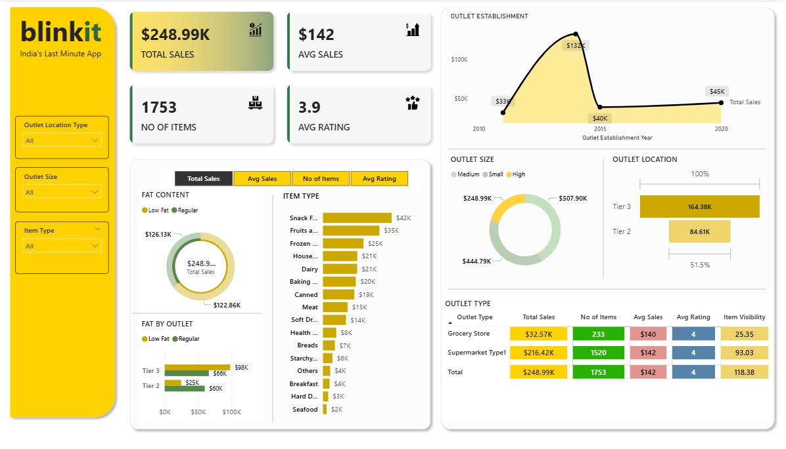

# 📊 BlinkIt Analytics Dashboard – Power BI Project

This project presents a real-world dashboard built in **Power BI** to analyze the performance of BlinkIt (formerly Grofers), a hyperlocal grocery delivery service. The dashboard enables deep insights into sales, delivery efficiency, and customer behavior using advanced **DAX**, **Power Query**, and data modeling techniques.

---

## 🔧 Tools & Technologies

- **Power BI** – Visualizations, DAX calculations, dashboard creation  
- **Power Query** – Data cleaning and transformation  
- **DAX** – Custom KPIs and time-based measures  
- **Excel (optional)** – For initial data structuring or exports  

---

## 📁 Files Included

- `BlinkIt_Analytics.pbix` – Power BI dashboard file  
- `Screeshot_BlinkIt_Dashboard.jpg` – Dashboard screenshot  
- `README.md` – Project documentation (this file)  

---

## 📊 Dashboard Highlights

- KPIs: Total Revenue, Avg. Delivery Time, Monthly Orders, Profit Margin  
- Visuals: Interactive bar charts, line graphs, category slicers  
- Features: Drill-down views, DAX-based time intelligence, user-friendly layout  
- Built-in refresh and process optimization using Power Query  

---

## 📌 Skills Demonstrated

- Intermediate/Advanced Power BI usage  
- Strong DAX logic and calculated columns/measures  
- Power Query transformations and data modeling  
- Visual storytelling with business impact  
- Clean layout and user-driven filtering for exploration  
- Independent project execution and presentation-ready output  

---

## 📷 Screenshot

  

---

## 🚀 How to Use

1. Download `BlinkIt_Analytics.pbix`  
2. Open in Power BI Desktop  
3. Explore filters, KPIs, and visuals  
4. Replace data source if using your own dataset  

---

## 👩‍💼 Author

**Aditi Patel** – Data Analyst | Power BI Developer  
📫 [LinkedIn Profile](https://www.linkedin.com/in/aditi-patel89/)

---

## 📝 Notes

- The dashboard uses mock/sample data to simulate business performance.  
- Inspired by real-world delivery analytics and built to showcase Power BI expertise.
